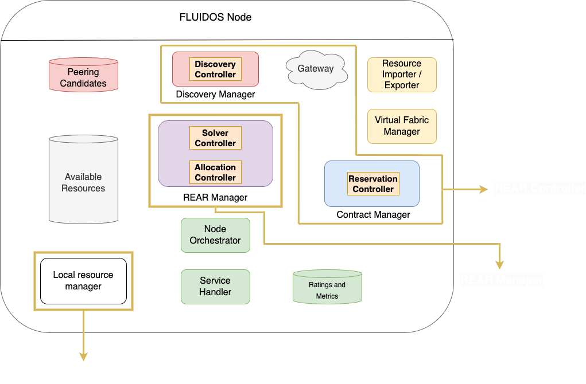

# Implementation
Regarding the implementation part, the components have been developed using **Kubernetes controllers** with Kubebuilder, making extensive use of the *Kubernetes API* and *Custom Resource Definitions (CRDs)*.

Under the image, the components of the FLUIDOS Node developed in this repository are highlighted in red circles:

See the different implementation for: 

- [**Components**](./components.md#components)
- [**Controllers**](./controllers.md#controllers)
