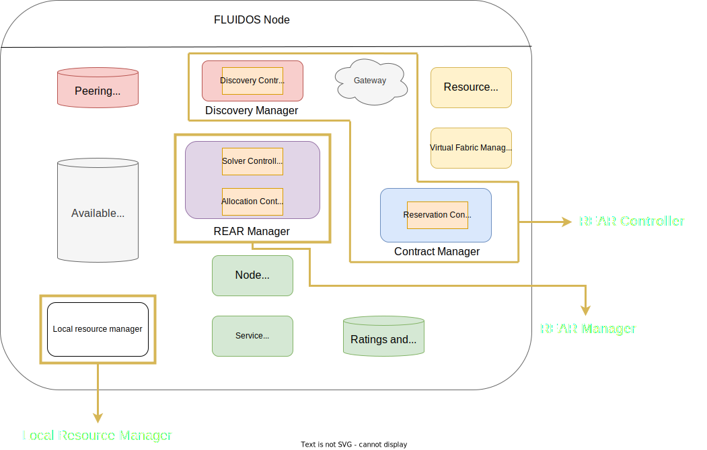

# Implementation

Regarding the implementation part, the components have been developed using **Kubernetes controllers** with Kubebuilder, making extensive use of the *Kubernetes API* and *Custom Resource Definitions (CRDs)*.

Implementation is divided into three main parts:

- **Local Resource Manager**, that contains the implementation of the Local Resource Manager component.
- **REAR Manager**, that contains the implementation of the REAR Manager component and the Solver & Allocation controllers.
- **REAR Controller**, that contains the implementation of the Discovery Manager, Gateway and Contract Manager components with the Discovery and Reservation controllers.

See the different implementation for:

- [**Components**](./components.md#components)
- [**Controllers**](./controllers.md#controllers)
- [**Custom Resources**](./customresources.md#custom-resources)
